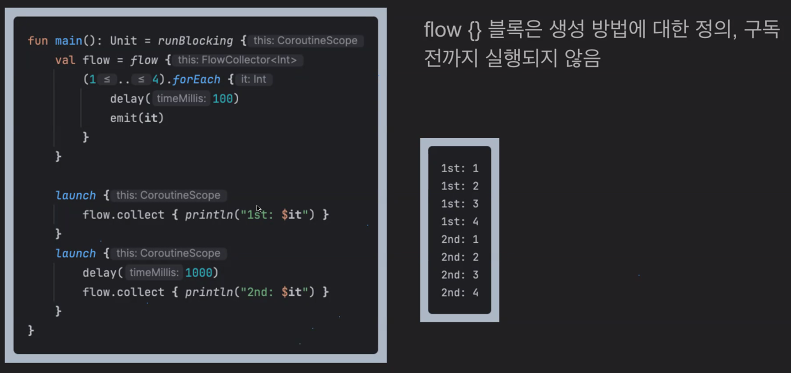

# pre_onboarding_android

Wanted 프리온보딩 Android 챌린지(2024년 3월, Modern Android 훑어보기) 학습 내용 기록

</br>
</br>
</br>

## 역량 향상 세션

### 03/07(목): Coroutine

<details>
<summary><b>0. 비동기 프로그래밍</b></summary>
<div markdown="1">

</br>


- **Blocking**
  - Caller가 Callee를 호출하고, Callee의 *결과를 받을 때까지 대기*한 이후 다음 작업 수행
- **Non-Blocking**
  - Caller가 Callee를 호출하고, Callee의 _결과를 기다리지 않고_ 바로 다음 작업 수행


- **Synchronous(동기)**
  - 작업을 _순서대로_ 수행(A가 끝나면 B를 수행)
- **Asynchronous(비동기)**

  - *순서와 무관*하게 작업을 수행함(A가 끝나지 않아도 바로 B를 수행)
  - 여러 작업을 동시에 수행할 수 있도록 하는 프로그램 패러다임

- 활용 예시
  

  - **Synchronous with Blocking**: 각 작업을 요청한 이후 응답을 기다림, 작업의 실행 순서와 완료 순서가 같음

  

  - **Asynchronous with Non-Blocking**: 각 작업을 요청한 이후 응답을 기다리지 않고 바로 다음 작업 시작, 작업의 실행 순서와 완료 순서가 다를 수 있음 -> CPU 리소스를 효율적으로 사용 가능

  - **Synchronous with Non-Blocking**: 각 작업을 요청한 이후 시작했다는 응답만 받고, 지속적으로 작업이 끝났는지 Caller가 확인함(Polling 등)

</div>
</details>

<details>
<summary><b>1. Coroutine이란?</b></summary>
<div markdown="1">

</br>

- 안드로이드에서 간단하게 비동기로 코드를 실행할 수 있는 동시성 디자인 패턴
- 전통적으로 비동기 프로그래밍은 Thread 기반으로 작업을 나눠 수행함, 즉 작업을 처리하는 단위가 Thread

  ```kotlin
  fun main() {
    thread(name = "Thread #1") {
      thread(name = "Thread #2") {
        val user = fetchUser()
        println(user)
      }

      thread(name = "Thread #3") {
        val product = fetchProduct()
        println(product)
      }
    }
  }
  ```

- Thread 방식의 문제점
  - Thread 생성 및 Context Switching 할 때 CPU와 메모리 소모가 큼
  - Blocking 방식으로 수행하면 대기하는 시간 동안 자원이 낭비됨
  - Thread 간 데이터 통신이 어렵고, 예외 처리 및 취소도 쉽지 않음
  - 코드 가독성이 좋지 않음
- Coroutine은 이러한 Thread 방식의 문제를 개선함

  

  - CPU 연산 및 메모리 소모가 Thread보다 훨씬 작음
  - 중단 메커니즘(suspend)를 이용해 Thread가 대기하지 않고 계속 일을 하게 함(자원 낭비 X)
  - 하나의 Thread에서 여러 Coroutine을 중단시키지 않고 실행시키거나, 여러 Thread를 오가면서 작업이 중단되거나 재개될 수 있음
  - Thread 간 데이터 통신이 쉽고, 예외 처리 및 취소도 용이함
  - 코드 가독성이 좋음

</div>
</details>

<details>
<summary><b>2. Coroutine 작성 방법</b></summary>
<div markdown="1">

1. 작업 단위(Coroutine) 구조화


- 부모 자식 관계(내부 포함), 작업 의존 관계(어떤 작업이 끝나야 다음 작업 실행) 등 작업 간 관계와 범위를 나누어서 구조화

2. Coroutine 별 Coroutine Scope 생성


- 각각 Coroutine Scope는 포함된 Coroutine의 생명주기를 관리함(생성, 실행, 취소)
- Structured Concurrency(구조적 동시성)을 지원하여 범위 간 관계에 따라 종료 및 취소가 전파됨
  - 취소: 부모 취소 > 모든 자식 취소, 자식 취소 > 부모 영향 X
  - 예외: 부모 예외 > 모든 자식 예외, 자식 예외 > 부모 예외 > 모든 자식 예외
- 범위 생성 방법
  - 미리 정의된 scope 사용
    - `GlobalScope`: App의 생명주기와 함께하는 scope
    - `lifecycleScope`: Component의 생명주기와 함께하는 scope
    - `viewModelScope`: ViewModel의 생명 주기와 함께하는 scope
  - 커스텀 scope 생성
    - `CoroutineScope(coroutineContext)`: coroutineContext로 작업 내용을 작성해서 생성
- Coroutine Context
  - Coroutine Scope에 binding되는, Coroutine에 필요한 정보들의 집합
  - Linked List 형태로 연결되어 있어 추가할 경우 `+` 연산 사용
  - 타입 별로 중복된 항목이 있을 경우 마지막 값으로 덮어씀
  - 주요 구성 요소
    - name: Coroutine의 이름
    - dispatcher: 어느 Thread에서 Coroutine을 실행할 것인지 정의
      - Dispatchers.Main: 주로 UI 작업
      - Dispatchers.IO: 파일, 네트워크 등 입출력 작업
      - Dispatchers.Default: CPU 집약적 작업
      - Dispatchers.Unconfined: 호출한 Thread에서 이어서 작업
      - Coroutine 내부에서 다른 Thread로 전환해서 작업을 수행하고 결과를 받아오고 싶을 경우, 중단 함수인 `withContext(dispatcher)` 사용
    - job: Coroutine의 생명주기를 관리, 추가하지 않아도 기본값으로 포함됨(필수)
      - Job 간 부모 자식 관계가 있어 구조적 동시성을 지원함
      - 실행 상태 변수, 시작 함수, 취소 함수, 완료 콜백 등 포함

3. Coroutine Scope 정보를 기반으로, Coroutine Builder를 사용하여 Coroutine을 메모리에 생성


|                                         | runBlocking                               | launch                                                                | async                                                                                                       | withContext |
| --------------------------------------- | ----------------------------------------- | --------------------------------------------------------------------- | ----------------------------------------------------------------------------------------------------------- | ----------- |
| Caller Blocking 여부                    | O                                         | X                                                                     | X                                                                                                           |
| Coroutine Scope 외부에서 사용 가능 여부 | O                                         | X                                                                     | X                                                                                                           |
| 특징                                    | - main 함수, test 등 특별한 경우에만 사용 | - Job 반환</br>- 비동기 작업 실행 후 다른 작업을 수행하는 경우에 사용 | - Deferred<T> 반환</br>- 비동기 작업 실행 후 다른 작업을 수행하다가 나중에 결과를 받아와야 하는 경우에 사용 |

> 대부분의 API는 Coroutine Scope의 확장 함수이기 때문에 Coroutine Scope 내부에서만 사용 가능함

4. suspend function으로 비동기 작업 실행


- suspend(중단), resume(재개)이 가능한 함수
- `suspend fun` 키워드로 선언
- suspend function 혹은 Coroutine Scope 안에서만 사용 가능(내부적으로 그렇게 규칙이 정해짐)
- Thread Blocking 없이 다른 작업을 기다릴 수 있음
- 결과 값을 콜백 없이 return 방식으로 순차적으로 받아올 수 있음

  <details>
  <summary><b>비동기 시나리오 실습</b></summary>
  <div markdown="1">

  > [코드](./day02_coroutine/hands-on-01.kt)

  
  
  
  
  

  </div>
  </details>

</div>
</details>

<details>
<summary><b>3. Coroutine 취소</b></summary>
<div markdown="1">

</br>

- 화면을 종료해서 더 이상 API로부터 데이터를 받아올 필요가 없거나, 시간이 비정상적으로 오래 걸려서 작업을 진행할 수 없는 경우 등, CPU와 메모리의 낭비가 발생해서 Coroutine을 취소해야 하는 경우가 발생함
- 취소 방법
  - launch의 반환값(Job)이나, async의 반환값(Job을 상속받는 Deferred<T>)의 `.cancel()`로 취소
    - 단, Deferred의 경우 await() 도중에 취소되면 JobCancellationException 발생
  - `withTimeout(time)` 사용
    - 중단 함수, 입력 받은 블록의 결과를 기다렸다가 반환해줌
    - 시간이 초과되면 TimeoutCancellationException 발생
  - scope의 `.cancel()`로 내부에 등록된 모든 Coroutine 취소
    - Android에서 Activity가 onDestroy에서 viewModelScope를 취소하는 것이 대표적인 예시
- 취소 시 자원을 해제하는 방법
  - 예외가 발생하는 부분을 `try ~ finally`로 감싸고, finally에서 자원 해제
  - Closable 인터페이스가 구현된 자원의 경우, `use {}` API 사용
  - Job에 종료 시 호출되는 리스너 `invokeOnCompletion` 등록, 인자를 기준으로 정상 종료인지 취소인지 구분하여 예외 처리 후 자원 해제
  - 콜백 기반 API와 호환해야 할 경우 `suspendCancellableCoroutine`를 사용, 인자로 받는 continuation을 콜백 안에서 사용해서 Coroutine을 resume하고 continuation의 `.invokeOnCancellation`을 활용해서 Coroutine이 취소될 경우 자원 해제
  - Coroutine 취소의 특징
    - 취소 요청 즉시 종료되지 않고, `delay()`나 `yield()`와 같이 중단되는 시점에 도달했을 때 비로소 취소 여부를 확인해서 종료함
    - 따라서 아래 예제는 중단점이 없기 때문에 영원히 취소되지 않음
      ```kotlin
      val job = launch {
        while (true) {
          println("in progress")
        }
      }
      job.cancel()
      ```
    - `yield()`: 현재 실행중인 Coroutine이 다른 Coroutine에 실행을 양보하고 중단 상태로 변경됨

</div>
</details>

<details>
<summary><b>4. Coroutine 예외 처리</b></summary>
<div markdown="1">

</br>

- `try ~ catch`
  - Coroutine 내부에서 예외를 처리할 때 사용
  - launch의 경우 예외가 발생할 가능성이 있는 로직을 감싸서 처리
  - awync의 경우 await() 시점을 감싸서 처리
  - 대부분의 예외를 처리할 때 권장되는 방식
- `CoroutineExceptionHandler`

  - Coroutine 외부에서 예외를 처리할 때 사용
  - CoroutineScope에 구현체를 binding

    ```kotlin
    val handler = CoroutineExceptionHandler { _, exception ->
      println("handler: Caught Exception: $exception")
    }

    launch(handler) {
      throw Exception("error")
    }
    ```

- `SupervisorJob`

  - Coroutine의 예외 전파 범위를 제어
  - 자식 Coroutine에서 예외가 발생해도 부모나 다른 자식에게 전파하지 않음
  - 단, launch 자체의 예외 발생으로 인해 앱은 종료되므로 예외 처리를 위해 CoroutineExceptionHandler와 함께 사용

    ```kotlin
    val handler = CoroutineExceptionHandler { _, exception ->
      println("handler: Caught Exception: $exception")
    }

    val scope = CoroutineScope(Dispatchers.Default + SupervisorJob() + handler)

    scope.launch {
      throw Exception("error")
    }
    ```

- `supervisorScope`

  - Coroutine이 중첩되어 있는 경우 사용
  - 부모 관계를 유지하면서 SupervisorJob을 가진 Coroutine을 생성하여 try ~ catch에서 예외를 처리하고 다른 Coroutine에 영향을 주지 않음

  <details>
  <summary><b>Coroutine 중첩 예외 처리 실습</b></summary>
  <div markdown="1">

  > [코드](./day02_coroutine/hands-on-02.kt)

  
  
  
  

  </div>
  </details>

</div>
</details>

<details>
<summary><b>5. Coroutine 공유 자원 처리</b></summary>
<div markdown="1">

</br>

- 여러 Thread에서 작업 단위가 동시에 실행되는 구조이기 때문에 공유 자원 동기화가 필요함
- Multi Threading에서 공유 자원을 처리하는 것은 꽤나 까다로운 작업임
- 따라서 성능 최적화가 필요한 경우 사용할 수 있는 기술 중 적절한 것을 선택하고, 최고의 성능이 필요하지 않다면 유지 보수가 쉬운 방식을 선택하는 것도 방법임
- `synchronized`

  ```kotlin
  var count = 0
  val lock = Any()
  val scope = CoroutineScope(Dispatchers.Default)
  val job = scope.launch {
    repeat(1000) {
      launch {
        repeat(1000) {
          synchronized(lock) {
            count++
          }
        }
      }
    }
  }

  job.join()
  ```

  - lock을 통해 한 번에 하나의 Thread만 내부 블럭을 실행하도록 하여, 여러 Thread에서 변수에 동시에 접근하는 것을 막음
  - 블럭 내부에서 중단 함수를 호출할 수 없음
  - 다른 Thread를 Blocking할 수 있어 비효율적임

- `Atomic` 객체

  ```kotlin
  var count = AtomicInteger(0)
  val scope = CoroutineScope(Dispatchers.Default)
  val job = scope.launch {
    repeat(1000) {
      launch {
        repeat(1000) {
          count.incrementAndGet()
        }
      }
    }
  }

  job.join()
  ```

  - 연산을 할 때 여러 Thread가 충돌해도 원자성 보장
  - 내부적으로 Compare and Swap을 사용: 예상 값과 동일한 경우에만 값을 업데이트하고, 경합이 일어나서 예상 값과 달라지면 다시 값을 산정하여 업데이트 시도
  - Coroutine Scope에서 실행될 수 있고, Thread 간 Blocking이 발생하지 않음
  - 그러나 블록 단위로 막아주는 것은 아니기 때문에 복잡한 로직은 원자성을 보장하지 못함 > 간단한 공유 자원의 경우에만 권장

- `SingleThreadDispatcher`

  ```kotlin
  var count = 0
  val singleThreadDispatcher = Executors.newSingleThreadExecutor().asCoroutineDispatcher()
  val scope = CoroutineScope(singleThreadDispatcher)
  val job = scope.launch {
    repeat(1000) {
      launch {
        repeat(1000) {
            count++
        }
      }
    }
  }

  job.join()
  ```

  - 여러 Thread 경합이 문제이므로, 하나의 Thread에서만 Coroutine이 실행되도록 제한함
  - 경합은 발생하지 않지만 성능적 한계가 있음(실제로 한계를 느끼는 경우가 많지는 않음)

- `Mutex`

  ```kotlin
  var count = 0
  val mutex = Mutex()
  val scope = CoroutineScope(Dispatchers.Default)
  val job = scope.launch {
    repeat(1000) {
      launch {
        repeat(1000) {
          mutex.withLock {
            count++
          }
        }
      }
    }
  }

  job.join()
  ```

  - 특정 구간에 대해 다른 Thread의 접근을 막을 수 있음
  - synchronized와 유사하게 withLock을 사용
  - 그러나 synchronized와 달리 경합이 발생할 경우 Thread를 Blocking이 아니라 suspend 시킴

- `Semaphore`

  ```kotlin
  var count = 0
  val semaphore = Semaphore(1)
  val scope = CoroutineScope(Dispatchers.Default)
  val job = scope.launch {
    repeat(1000) {
      launch {
        repeat(1000) {
          semaphore.withPermit {
            count++
          }
        }
      }
    }
  }

  job.join()
  ```

  - Mutex와 유사, 차이점은 구간에 접근 가능한 Thread를 여러 개로 설정할 수 있다는 것

</div>
</details>

<details>
<summary><b>6. Coroutine Channel</b></summary>
<div markdown="1">

</br>

- Queue와 유사한 형태, send를 통해 데이터를 삽입하고 receive를 통해 데이터를 추출함
- 이때 send와 receive가 suspend function으로, 여러 Coroutine이 하나의 Channel에서 Thread를 Blocking하지 않음
- 이로 인해 여러 Coroutine에서 데이터를 안전하고 효율적으로 주고받을 때 사용
- Channel을 이용한 Producer and Consumer 패턴 구현

  ```kotlin
  val channel = Channel<Int>(2)

  // Producer
  launch {
    for (i in 0..10) {
      channel.send(i)
      delay(100)
    }
    channel.close()
  }

  // Consumer
  launch {
    for (i in 0..10) {
      println(channel.receive())
    }
  }
  ```

  - Producer Coroutine에서는 지속적으로 데이터를 생산해서 send하고, Consumer Coroutine에서는 지속적으로 데이터를 receive해서 소비함
  - 생산과 소비를 분리시켜 각자 최대한의 성능을 확보함
  - Channel을 적용하여 병목 현상이 발생해도 Thread가 Blocking되지 않고 suspend됨
  - 생산과 소비의 속도에 차이가 날 수 있기 때문에, channel 생성 시 최대 데이터 누적 수(capacity)를 인자로 설정하여 전체 속도를 조절함

- capacity 설정 정책
  - `RENDEZVOUS`(default): 데이터를 쌓을 수 있는 버퍼가 없음(0) -> 다음 소비가 일어날 때까지 생산이 일어나지 않음
  - `UNLIMITED`: 버퍼가 무한대 -> Out of Memory 주의 필요
  - `BUFFERED`: 고정된 버퍼 사용 -> 시스템 설정에 따라 수량을 결정
  - `CONFLATED`: 버퍼 크기가 1이지만, 데이터가 추가로 들어올 경우 마지막 데이터로 버퍼를 덮어씀
- 데이터가 버퍼를 넘어서서 들어오는 경우 정책
  - `SUSPEND`(default): 생산 함수를 중단하고 대기
  - `DROP_OLDEST`: 버퍼에서 가장 오래된 데이터를 삭제하고 새로운 데이터 추가
  - `DROP_LATEST`: 버퍼에서 가장 최신의 데이터를 삭제하고 새로운 데이터 추가

</div>
</details>

<details>
<summary><b>7. Coroutine Flow</b></summary>
<div markdown="1">

</br>

- Reactive Programming

  

  - 연속된 데이터의 변화를 관찰(Observer Pattern)

    

    - 데이터 발행에 필요한 비즈니스 로직을 제 3자에게 위임하고, 발행 시 Callback으로 업데이트함
    - 데이터 발행을 이벤트라고 가정했을 때 이벤트 스트림에 의해 observser가 push되는 구조
    - 데이터 변화를 스트림으로 해석하여 스트림의 데이터가 변할 때마다 Callback을 실행함

  - 변화된 데이터 가공 후 지속적으로 전파

    

    - Functional Programming: 여러 함수를 결합해서 입력 값을 최종 출력 값으로 만드는 함수를 생성

- Flow

  - Reactive Programming을 지원하는 데이터 스트림 API
  - 구성 요소

    - Producer: 데이터를 발행해서 스트림을 생성
      - `flowOf()`: 원시 값을 flow 스트림으로 변환
    - `.asFlow()`: Collection, Range 등 타입에 정의된 API, 데이터를 flow 스트림으로 변환
    - `flow {}`: 블럭 안에서 데이터를 방출(emit)
      ```kotlin
      val dataFlow = flow {
        while (true) {
          emit(Date())
          delay(1000)
        }
      }
      ```
    - `callbackFlow {}`: 일반적으로 콜백 함수는 suspend function이 아니기 때문에 emit을 호출할 수 없음 > callbackFlow {} 내부에서 콜백을 정의하면 콜백에서 `trySend()`로 데이터를 emit할 수 있음 + `awaitClose {}`로 flow가 종료됐을 때 실행할 코드도 등록할 수 있음

      ```kotlin
      private val connectivityManager = context.getSystemService(Context.CONNECTIVITY_SERVICE) as ConnectivityManager

      val isNetworkAvailable = callbackFlow {
        val callback = object: ConnectivityManager.NetworkCallback() {
          override fun onAvailable(network: Network) {
            trySend(true)
          }
          override fun onUnavailable() {
            trySend(false)
          }
        }

        val request = NetworkRequest.Builder().build()
        connectivityManager.registerNetworkCallback(request, callback)

        awaitClose { connectivityManager.unregisterNetworkCallback(callback) }
      }
      ```

    - Intermediary: 스트림 내부 데이터를 목적에 맞게 변경(생략 가능)
      - `filter {}`: 조건에 부합하는 데이터만 남김
      - `map {}`: 데이터의 형태를 변경
    - Consumer: 스트림을 관찰, 발행되는 데이터를 소비해서 최종 결과 로직을 수행
      - `.collect {}`: 연결된 flow가 종료되거나 Coroutine이 종료될 때까지 유지됨

- StateFlow

  - Flow + StateHolder, Flow에 상태 관련 기능이 추가된 형태
  - Flow와 같은 데이터 스트림인데 마지막 상태 값을 저장함(현재 상태 보존)
  - 이벤트가 발생했을 때, 변경된 데이터만 방출함
  - android에서 view의 상태를 나타낼 때 사용하여, view가 재생성되도 마지막 상태를 읽어 렌더링할 수 있고 변경되었을 때만 새로 그릴 수 있음
  - 데이터 공유 시, 이벤트 버스처럼 마지막 상태 없이 지속적으로 방출하는 스트림을 만들고 싶다면 `SharedFlow` 사용

  ```kotlin
  // MainViewModel.kt
  private val _username = MutableStateFlow("Unknown")    // 생성
  val username = _username.asStateFlow()    // 불변성 부여 -- 읽기 전용

  init {
    viewModelScope.launch {
      _username.update { loadUserName() }    // 값 갱신
    }
  }

  private suspend fun loadUserName(): String {
    delay(2000)
    return "username"
  }


  // MainActivity.kt

  val viewModel = viewModel<MainViewModel>()
  val username by viewModel.username.collectAsState()    // Compose 상태로 변경
  Text(text = "number: $number")
  ```

- Flow vs StateFlow

  
  

  | Flow                                                           | StateFlow                                                                                                              |
  | -------------------------------------------------------------- | ---------------------------------------------------------------------------------------------------------------------- |
  | Cold Stream                                                    | Hot Stream                                                                                                             |
  | 데이터 발행이 느림, 요청하지 않으면 발행하지 않음              | 데이터 발행이 빠름, 요청하지 않아도 발행함                                                                             |
  | 데이터 발행 방식을 정의하고, 구독자가 나타나면 데이터를 발행함 | 데이터가 발행되는 즉시 이벤트를 방출하고, 구독자 모두에게 브로드캐스팅함, 구독 시점 이후로 수신하는 이벤트만 수집 가능 |

- Flow > stateIn > StateFlow

  ```kotlin
  // MainViewModel.kt
  val number = loadNumbers().stateIn(
    viewModelScope,    // flow를 계속 관찰해서 이벤트를 중계할 Coroutine이 실행될 Coroutine Scope
    SharingStarted.WhileSubscribed(5000),    // 중계를 언제부터 시작할지에 대한 정책
    -1    // 초기 값
  )

  private fun loadNumbers() = flow {
    (1..4).forEach {
      delay(1000)
      emit(it)
    }
  }


  // MainActivity.kt

  val viewModel = viewModel<MainViewModel>()
  val username by viewModel.username.collectAsState()
  Text(text = "number: $number")
  ```

  - 중계 정책
    - `SharingStarted.Eagerly`: 즉시 시작, 종료 안 함
    - `SharingStarted.Lazily`: 첫 구독자가 나타나면 시작, 종료 안 함
    - `SharingStarted.WhileSubscribed(time)`: 첫 구독자가 나타나면 시작, 마지막 구독자가 없어지면 time만큼 기다렸다가 종료

</div>
</details>

</br>
</br>
</br>

### 03/04(월): Compose

<details>
<summary><b>1. Compose란?</b></summary>
<div markdown="1">

</br>

- 네이티브 UI 작성을 위한 모던 툴킷
- view들을 합성(compose)해서 view를 구성
- view가 상속이 아닌 확장을 통해 만들어짐
- UI를 XML이 아닌 kotlin으로 작성
- 정식 출시 2021년 7월말, 성장 속도가 빠름
- XML의 단점
  - view의 계층과 속성 구조가 분리되어 있어 관리가 어려움
  - namespace(`android:`, `app:`...) 등으로 인해 표현 내용에 비해 오버헤드가 발생함
  - view에 접근하기 위해 `findViewById()`와 같은 탐색이 필요함
  - 개발자가 상태 변경 타이밍을 고려하여, 직접 노드에 api 접근 후 상태를 변경해야 함
- Compose의 장점
  - XML에 비해 계층 구조 표현이 간결하고, 코드량이 적음
  - 선언형 UI 방식으로 순수하게 UI 표현에만 집중함
  - 데이터가 바인딩되어 있어 view의 상태 변경이 자동으로 이루어짐
  - navigation, viewmodel, coroutine 등 프레임워크 레벨에서 적극적으로 지원되고, 코드에서 동적으로 view 로직을 적용할 수 있음
  - MaterialDesign, Theme 등 디자인 측면에서 간편한 API 구조와 다양한 기본 기능을 제공함
  - Animation API가 강력함

<details>
<summary>선언형 UI</summary>
<div markdown="1">

- UI를 어떻게 만드는지가 아닌, 오로지 어떤 UI를 만들 것인지에만 집중하는 UI 개발 방법론
  - 명령형 UI: name 상태가 바뀌면 개발자가 setText로 view의 text를 직접 바꿔줌
  - 선언형 UI: view의 text에 name 상태가 바인딩되어, name 상태가 바뀌면 UI가 자동으로 view의 text를 바꿈
- view에서 event가 발생하면 state가 변경되고, 변경된 state가 data를 view에 전달하여 이를 표시함
- 개발자는 view와 state를 바인딩하고, event가 발생했을 때 어떻게 state를 변경할 것인지에 집중함 → 데이터와 상태의 연결, 유지보수가 용이함

</div>
</details>

</div>
</details>

<details>
<summary><b>2. Compose View 작성 기초</b></summary>
<div markdown="1">

</br>

- `@Composable` 함수
  - 합성의 대상이 되는 구성 요소
  - 어노테이션을 작성해야 컴파일러가 해당 함수를 compose view로 인식함
  - 단독으로도 view가 될 수 있고, 여러 Composable을 합성해서 사용할 수도 있음
  - `{}`에 다른 Composable 함수를 호출(자식 view)하는 방식으로 계층 구조를 정의
  - 속성 값, 데이터를 인자로 받을 수 있음
  - 반환값이 없음
  - Idempotent(멱등성, 입력값이 같으면 항상 동일한 결과를 내야 함)을 준수해야 함 → 준수하지 않으면 예측 불가능해서 UI 버그 발생 가능
- `setContent`: activity에 compose view를 content로 주입
- `Modifier`: 컴포넌트를 꾸미는 수정자, 사이즈/형태/행위/외면 등 변경 가능, 내부 레이블 같은 정보나 사용자 입력 처리도 가능, 체이닝이 가능하나 순서에 따라 결과가 달라짐
  - view의 모양이나 형태 등 속성을 바꾸려면 컴포넌트 각각에 직접 속성 값을 설정하거나, modifier를 통해 설정할 수 있음
- 주로 사용하는 기본 컴포넌트
  - `Text`
  - `Button`: xml과 달리 Text를 상속받지 않기 때문에 Text를 내부에 추가해야 함
  - `TextField`: EditText, 선언형 UI 특성상 데이터 바인딩(`value = name`)과 이벤트 방출(`onValueChange = { name = it }`)에 집중함
    ```kotlin
      fun Greeting() {
        var name by remember { mutableStateOf("") }
        TextField(
          value = name,
          onValueChange = { name = it }
        )
      }
    ```
  - `Column`, `Row`: LinearLayout
  - `Box`: FrameLayout, z축으로 쌓음(=view가 포개짐)
  - `LazyColumn`, `LazyRow`: RecyclerView와 유사, 다만 재사용이 아니라 필요할 때 필요한 만큼 생성, 어댑터 불필요, `items(data) { Text(data.text) }` 와 같은 형식으로 사용

</div>
</details>

<details>
<summary><b>3. Compose가 화면을 그리는 과정</b></summary>
<div markdown="1">

</br>

1. Composition: 화면에 있는 Composable을 파싱해서 메모리에 UI 트리를 생성함 → Composable 함수의 코드 블럭이 실행됨
2. 생성된 UI 트리를 기반으로 화면에 표시함 → 각 플랫폼에 맞는 렌더링 로직이 실행됨
3. Recomposition: data가 변경되면 변경된 부분만 UI 트리가 새로 그려짐
4. 변경되지 않은 부분은 생략됨(재사용) → 성능 개선을 위해, data가 같으면 결과가 같아서 재사용되도록 코드를 작성해야 함(Idempotent)

**※ Recomposition 시 재사용되는 기준**

- 원시 타입, String, MutableState 등: 값의 비교를 기본적으로 지원하여 알아서 재사용됨
- 모양도 같고 인자가 같은 함수: call site(함수 호출 위치)를 id로 사용하기 때문에 재사용되지 않음
- 반복문: call site는 동일하지만 실행 순서를 기준으로 구분함
  - 실행 순서가 같으면서 값도 같으면 재사용됨
  - 그러나 맨 앞에 요소가 추가되는 등 순서가 바뀌면 재사용되지 않음
  - 이때, `key()`를 사용하면 순서가 바뀌어도 비교 후 재사용됨
- 객체: 내부 프로퍼티를 var로 선언하면 재사용되지 않음, val로 변경하면 재사용됨
- `@Stable`: 컴파일러에게 변하지 않을 것이라고 알려 재사용됨, 단 유저가 값을 바꿔서 화면과 상태가 달라지는 버그가 발생할 수 있음

⇒ Recomposition은 UI 트리 생성 속도 최적화를 가장 중요시함
⇒ 이로 인해 Composable 함수는 순서대로 실행되지 않거나, 메인 스레드에서 실행되지 않거나, 빠르게 다시 실행될 수 있음

</div>
</details>

<details>
<summary><b>4. Compose의 상태 관리</b></summary>
<div markdown="1">

</br>

- 일반 로컬 변수: Recomposition 시점에 함수가 재실행되면 초기화되어 상태가 유지되지 않음
- `remember {}` : 로컬 변수와 달리, 시스템 캐시에 값을 저장하여 Recomposition 되더라도 상태가 유지됨
- `rememberSavable {}`: 화면 회전 등으로 인해 Activity가 재생성되어도 상태가 유지됨
- `mutableStateOf()`: remember와 rememberSavable 내부에 선언, `.value`로 값에 접근, 값의 변화가 관찰됨 -`by remember…(property delegation, getter와 setter를 위임)`으로 상태 선언 시 `.value` 생략하고 접근 가능
- Stateful: Composable 함수 내에 상태가 있음 → 외부에서 이를 사용할 때 상태를 고려해서 사용해야 함 → 재사용성이 떨어지고 테스트가 어려움
- Stateless: Composable 함수 내에 상태가 없고 외부로부터 상태 값과 관리하는 로직을 주입받음 → 재사용성을 고려하여 권장되는 방식
  - State Hoisting: Stateful 함수였으나, 외부에서 상태를 주입 받도록 수정하여 Stateless로 만드는 것
  - 상태 변경 시 데이터 흐름
    1. Click 이벤트가 발생하여 count의 상태가 변경됨
    2. Compose에게 count의 상태가 변경되었다는 알림이 감
    3. Recomposition이 실행되어 변경된 상태를 참조하는 부분을 찾아서 다시 그림

</div>
</details>

<details>
<summary><b>5. Compose의 LifeCycle과 Side Effect</b></summary>
<div markdown="1">

</br>

- LifeCycle
  1. Enter the composition: Composable 함수를 분석해서 메모리에 UI 트리를 그림
  2. Recompose: 상태가 바뀌어서 Recomposition 발생
  3. Leave the composition: 더 이상 필요 없어져서 UI 트리에서 삭제
- Side Effect
  - Composable 함수 외부에서 일어나는 앱의 상태 변화(네트워크 통신, snackbar 표시 등)
  - SideEffect가 발생하지 않도록, UI 렌더링과 외부 상태 변경을 결합하지 않아야 함 → 라이프사이클을 고려한 API가 제공됨
  - `LaunchedEffect(key)`: Composition 시점에만 한 번 실행, 기본적으로 Coroutine 사용, key를 넣으면 key가 바뀔 때마다 실행됨
  - `DisposableEffect(key)`: Composition 시점에 실행 후 Decomposition 시점에 onDispose 블럭(필수) 실행, key를 넣으면 key가 바뀔 때마다 실행됨
  - `SideEffect`: Composition, Recomposition 시점에 실행, 화면 렌더링과 별개로 완료되어야 하는 작업에 사용

</div>
</details>

</br>
</br>
</br>

---

## 사전 미션

- [Jetpack Compose](https://github.com/celpegor216/pre-onboarding-android/tree/main/basics_jetpack_compose)
- [Coroutine](https://github.com/celpegor216/pre-onboarding-android/tree/main/basics_coroutine)
