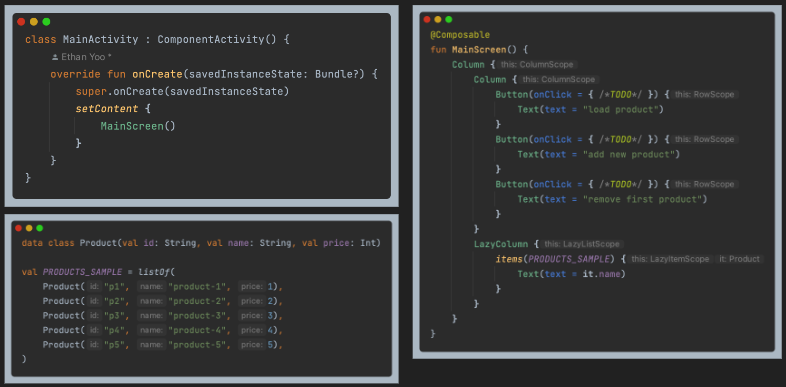
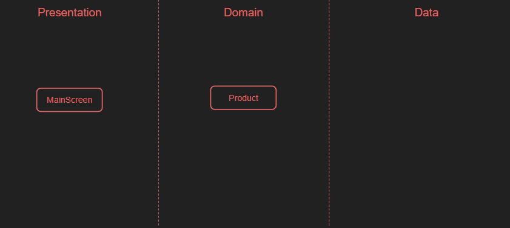
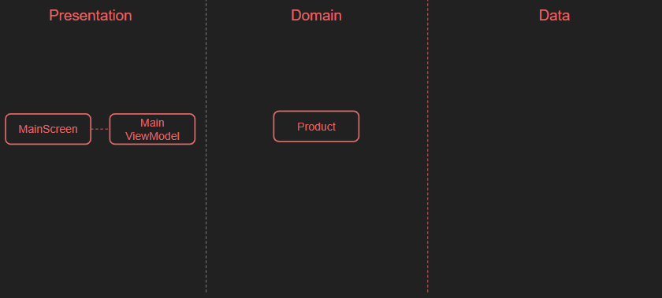
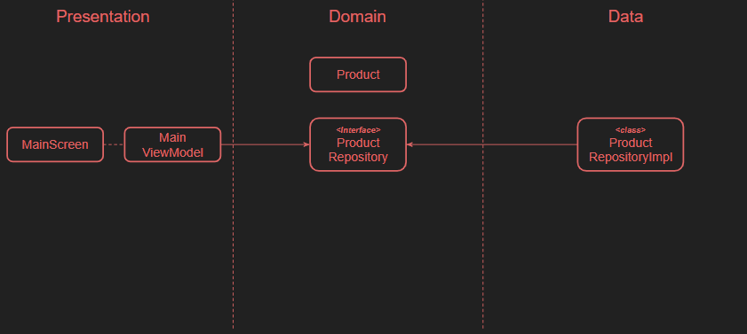

# MVVM + Clean Architecture 예제

## 기능 요구 조건

- Product 목록을 불러와서 화면에 출력
- 새로운 Product 추가
- 마지막 Product 삭제

## 단계 별 진행

<b>0. 프로젝트 세팅</b>

 

- MainActivity 내에 MainScreen, Product 구성

<b>1. package 세팅</b>

 

- Package를 나누는 방법은 `Layer` 단위로 나누는 방식과 `Feature` 단위로 나누는 방식이 있음
- 본 예제에서는 Layer를 구분해서 학습하기 위해 Layer 단위로 나눔
- Layer 구조
  - Presentation Layer: ComposeView, ViewModel
  - Domain Layer: UseCase, RepositoryInterface, DomainModel
  - Data Layer: RepositoryImpl, DataSource, DataModel

<b>2. ViewModel 생성 및 연결</b>

 

- ViewModel 생성
  - 상태(products) 및 관련 함수 생성
- ViewModel과 Screen 연결
  - `androidx.lifecycle:lifecycle-viewmodel-compose` 및 `androidx.lifecycle:lifecycle-runtime-compose` 라이브러리 추가
  - Screen에 ViewModel의 상태 및 관련 함수 연결

<b>3. Repository 생성 및 연결</b>

 

- Repository 생성
  - ViewModel의 상태(products) 및 관련 함수 이전
  - 인터페이스는 Domain Layer, 구현체는 Data Layer
- Repository ViewModel 연결
  - DI를 위해 전역 객체 관리 도구(`DependenciesProvider`) 생성
  - Repository를 ViewModel에 주입해서 상태 및 관련 함수 연결
  - stateIn으로 Flow -> StateFlow 변경해 구독

